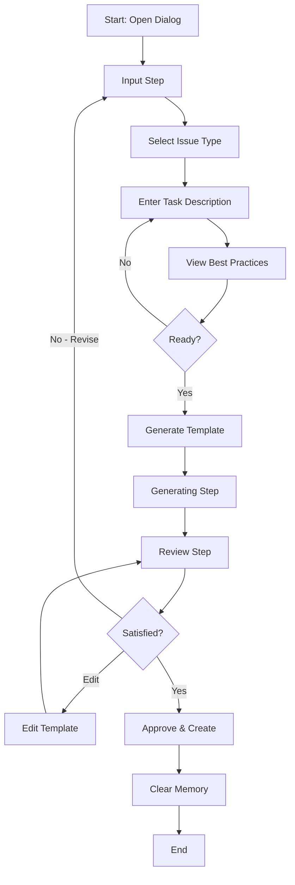

# Jira Intent Task

## Overview

The Jira Intent Task feature provides an intelligent workflow for creating well-structured Jira tickets from task descriptions. It generates professional ticket templates with descriptions, acceptance criteria, and documentation text—**no code is generated or read**, only descriptive content for Jira tickets. The feature follows best practices for different issue types.

## Features

### 1. **Task Description Input**
- Reads the existing task description and title
- Allows users to provide additional context
- Supports multiple issue types: Bug, Task, and Story

### 2. **Best Practices Guidance**
The dialog provides contextual best practices based on the selected issue type:

#### Bug Best Practices
- Clear reproduction steps
- Expected vs actual behavior
- Environment details

#### Task Best Practices
- Clear objective definition
- Specific acceptance criteria
- Dependencies identification

#### Story Best Practices
- User-centric perspective
- Value statement
- Testable acceptance criteria

### 3. **Template Generation**
Automatically generates structured templates with descriptive text and documentation only. **No code is generated—only descriptions, acceptance criteria, and additional information text** suitable for Jira tickets:

#### For Bugs:
- **Description**: Summary, steps to reproduce, expected/actual behavior, environment
- **Acceptance Criteria**: Bug resolution checklist
- **Additional Information**: Priority justification, related issues, screenshots/logs

#### For Tasks:
- **Description**: Overview, context, implementation details
- **Acceptance Criteria**: Completion checklist
- **Additional Information**: Technical requirements, dependencies, testing notes

#### For Stories:
- **Description**: User story format, background, goals, user value
- **Acceptance Criteria**: Feature completion checklist
- **Additional Information**: Design considerations, technical notes, scope boundaries

### 4. **Review and Edit Workflow**
- **Review Mode**: Preview the generated template in a formatted view
- **Edit Mode**: Click any section to edit inline
- **Toggle View**: Switch between preview and edit modes
- **Real-time Updates**: Changes are immediately reflected

### 5. **Memory Management**
- Template content is stored in component state during the session
- Content persists through the revision workflow
- Memory is cleared when:
  - User approves and creates the ticket
  - User cancels the dialog
  - Dialog is closed

## Workflow Steps



## Usage

### Opening the Dialog

```typescript
import { JiraIntentTaskDialog } from '@/components/dialogs';
import { show } from '@ebay/nice-modal-react';

// Open dialog with a task
show(JiraIntentTaskDialog, {
  task: selectedTask
});
```

### Props

```typescript
interface JiraIntentTaskDialogProps {
  task: TaskWithAttemptStatus;
}
```

## Implementation Details

### Component Structure

```
JiraIntentTaskDialog
├── Input Step
│   ├── Task Information Display
│   ├── Issue Type Selector
│   ├── Description Textarea
│   └── Best Practices Panel
├── Generating Step
│   └── Loading Indicator
└── Review Step
    ├── Success Alert
    ├── Description Section (editable)
    ├── Acceptance Criteria Section (editable)
    ├── Additional Information Section (editable)
    └── Action Buttons
```

### State Management

```typescript
type WorkflowStep = 'input' | 'generating' | 'review';
type JiraIssueType = 'Bug' | 'Task' | 'Story';

interface JiraTicketTemplate {
  description: string;
  acceptanceCriteria: string;
  additionalInformation: string;
}
```

### Key Functions

- `generateJiraTemplate()`: Creates template based on issue type and description
- `handleGenerate()`: Initiates template generation
- `handleRevise()`: Returns to input step for modifications
- `handleApprove()`: Finalizes and clears memory
- `handleUpdateField()`: Updates specific template fields during review

## Design Principles

1. **No Code Reading**: The feature does not read project code files
2. **No Code Generation**: Does not generate code - only creates descriptive documentation text
3. **Description & Text Only**: Generates Jira ticket descriptions, acceptance criteria, and documentation
4. **Template-Based**: Uses predefined templates for consistency
5. **Fallback Support**: Defaults to standard template if custom templates unavailable
6. **Memory Safety**: Clears all stored content upon approval or cancellation
7. **User Control**: Allows full revision and editing capabilities

## Best Practices for Usage

1. **Provide Detailed Descriptions**: More context leads to better templates
2. **Choose Correct Issue Type**: Select the type that best matches your ticket
3. **Review Thoroughly**: Always review generated content before approval
4. **Edit as Needed**: Customize the template to fit your specific needs
5. **Use Best Practices Guide**: Reference the provided guidelines while writing

## Future Enhancements

Potential improvements for future versions:

- Integration with actual Jira API to create tickets
- Custom template support per project
- Template history and reuse
- AI-powered description enhancement
- Attachment upload support
- Priority and assignee auto-suggestion
- Link to related tasks/issues

## Troubleshooting

### Template Generation Fails
- Ensure task description is not empty
- Check console for error messages
- Try simplifying the description

### Cannot Edit Template
- Click on the section you want to edit
- Ensure you're in review mode
- Look for the edit cursor indicator

### Memory Not Clearing
- Approve or cancel explicitly
- Avoid force-closing the dialog
- Refresh if state persists incorrectly

## Related Components

- `JiraReviewDialog`: Simpler Jira review interface
- `TaskFormDialog`: Main task creation dialog
- `jira.rs`: Backend Jira integration service

## Testing

To test the Jira Intent Task dialog:

1. Open the application
2. Select a task
3. Trigger the Jira Intent Task dialog
4. Choose an issue type
5. Enter a description
6. Click "Generate Template"
7. Review the generated content
8. Test editing capabilities
9. Test revision workflow
10. Test approval and memory clearing

## Notes

- The current implementation uses simulated generation (2-second delay)
- Replace the `generateJiraTemplate` function with actual AI/API calls in production
- Templates are optimized for Jira Cloud format
- Markdown formatting is preserved in the templates
